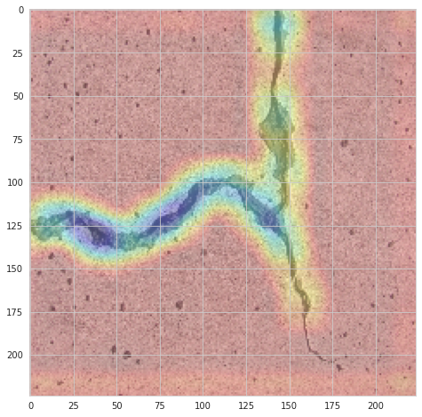

<h1  align=center>Concrete Crack Classification with Class Activation Map</h1>

 

<small>Picture Source:<a  href="https://github.com/doguilmak"> Doğu İlmak Github</a>

 

<h2>Description</h2>

The dataset contains concrete images having cracks. The data is collected from various METU Campus Buildings.

The dataset is divided into two as negative and positive crack images for image classification. Each class has<i> 20000</i> images with a total of <i>40000</i> images with <i>227 x 227</i> pixels with RGB channels. The dataset is generated from 458 high-resolution images (4032x3024 pixel) with the method proposed by Zhang et al (2016). High-resolution images have variance in terms of surface finish and illumination conditions. No data augmentation in terms of random rotation or flipping is applied. For more details about this project, please open <a href="https://github.com/doguilmak/Concrete-Crack-Classification-with-CAM/blob/main/Crack_CAM.ipynb">Crack_CAM.ipynb</a> notebook. The results of the model on the test data are in the <a  href="https://github.com/doguilmak/Concrete-Crack-Classification-with-CAM/blob/main/model_predictions.csv">model_predictions.csv</a> file. Just click the link to view.

 

<h2>Acknowledgements</h2>

This dataset has been referred from <a  href="https://data.mendeley.com/datasets/5y9wdsg2zt/2">data.mendeley.com</a>.

<i>If you use this dataset please cite: 2018 – Özgenel, Ç.F., Gönenç Sorguç, A. “Performance Comparison of Pretrained Convolutional Neural Networks on Crack Detection in Buildings”, ISARC 2018, Berlin.</i>

 

<h2>License</h2>

<b>CC BY 4.0</b>

The files associated with this dataset are licensed under a Creative Commons Attribution 4.0 International license.

What does this mean?

You can share, copy and modify this dataset so long as you give appropriate credit, provide a link to the CC BY license, and indicate if changes were made, but you may not do so in a way that suggests the rights holder has endorsed you or your use of the dataset. Note that further permission may be required for any content within the dataset that is identified as belonging to a third party.

   

<h2>Objective:</h2>

<ul>
	<li>Understand the dataset & cleanup (if required).</li>
	<li>Build classification models to predict the concrete class.</li>
	<li>Also fine-tune the hyperparameters & compare the evaluation metrics of various classification algorithms.</li>
	<li>Build class activation maps (CAM).</li>
</ul>

 

<h2>Keywords</h2>

<ul>
	<li>Computer Science</li>
	<li>Classification</li>
	<li>Structure</li>
	<li>Class Activation Map</li>
	<li>Neural Networks</li>
	<li>Concrete (Composite Building Material)</li>
	<li>Concrete Cracking</li>
</ul>

 

<h2>Prediction with Class Activation Map (CAM)</h2>

	

Output(CAM Model)

<small>Without Crack Probability: 0.07245049625635147</small> 

<small>Crack Probability: 0.9275494813919067</small> 

Output

<small>Without Crack Probability: % 0.0</small> 

<small>Crack Probability: % 100.0</small> 

 

<h1>Contact Me</h1>

If you have something to say to me please contact me:

<ul>
  <li>Twitter: <a href="https://twitter.com/Doguilmak">Doguilmak</a></li>
  <li>Mail address: doguilmak@gmail.com</li>
</ul>
